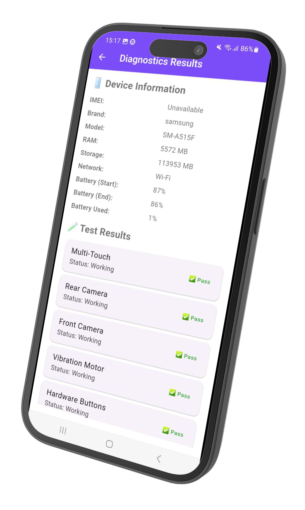
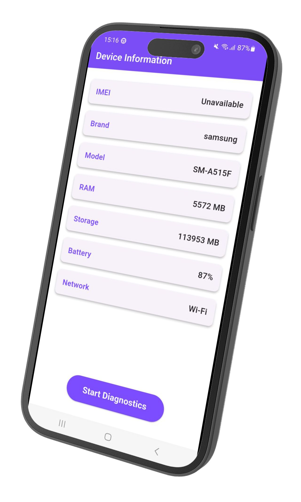

# 📱 Device Diagnostic Tool — Check Your Phone’s Health


**Device Diagnostic Tool** is your all-in-one solution for testing and analyzing your smartphone’s hardware components.  
Easily run tests for **multi-touch**, **camera**, **buttons**, **vibration**, **battery**, and more — all in one clean, easy-to-use app.  

📦 **Now available on Amazon Appstore** → [Download Here](https://lnkd.in/dVAs3uf9)

---

## 🔍 Features

- ✅ **Multi-touch test** — check your screen touch sensitivity  
- ✅ **Front/Rear camera test** — make sure your camera is working fine  
- ✅ **Vibration test** — ensure your phone’s vibration motor is responsive  
- ✅ **Button test** — test volume & power buttons  
- ✅ **Battery status** — monitor battery health & usage  
- ✅ **Device info** — get CPU, memory, and storage details  

---

## 📸 Screenshots

|  |  |
|-------------------------|-------------------------|

---

## ⚙️ Built With

- [Flutter](https://flutter.dev/) — Cross-platform UI toolkit  
- [Dart](https://dart.dev/) — Programming language  
- Native APIs — for hardware detection & diagnostics  

---

## 🚀 Installation & Run

```bash
# Clone the repository
git clone https://github.com/yourusername/device_diagnostic_tool.git

# Go to project directory
cd device_diagnostic_tool

# Install dependencies
flutter pub get

# Run on a connected device
flutter run
